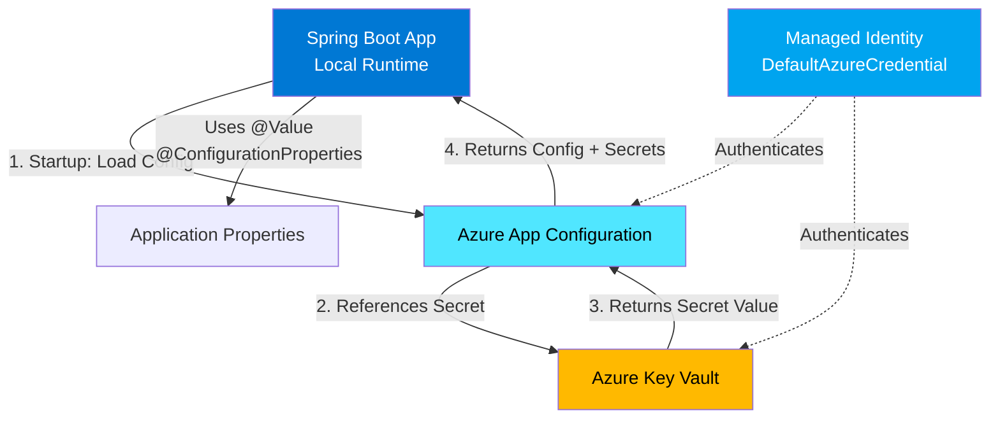

## Introduction

Hardcoding configuration in `application.properties` works fine until you need to deploy the same Spring Boot app across multiple environments—dev, staging, and production—each with different database endpoints, feature flags, and secrets. Managing these values through environment variables or config maps becomes tedious and error-prone at scale.

Azure App Configuration solves this by centralizing your configuration outside your application code, with built-in support for environment-specific values (via labels) and secure secret management through Key Vault references. Spring Cloud Azure integrates seamlessly, letting you use familiar `@Value` and `@ConfigurationProperties` annotations while your app pulls config from Azure at startup.

## Architecture

Here's how Spring Boot connects to Azure App Configuration and Key Vault locally:



When your Spring Boot app starts, Spring Cloud Azure queries App Configuration for key-value pairs. If a value is a Key Vault reference, it automatically resolves the secret. All of this happens before your beans initialize, so properties are ready to inject via `@Value`.

## Prerequisites

To follow along, you'll need:

- **Java 21** and **Maven 3.9+**
- **Azure CLI** installed and authenticated (`az login`)
- An **Azure subscription** (free tier works)
- Basic familiarity with Spring Boot and dependency injection

## Understanding Azure App Configuration and Key Vault

**Azure App Configuration** is a managed service for storing application settings and feature flags. Unlike hardcoded properties files, it supports:
- Environment-specific values using **labels** (e.g., `dev`, `prod`)
- Dynamic refresh (your app can reload config without restarting)
- Fine-grained access control via Azure RBAC

**Azure Key Vault** stores secrets, keys, and certificates. App Configuration can reference Key Vault secrets, so you centralize config in one place while keeping credentials secure.

## Setting Up Azure Resources

Deploy the infrastructure with Bicep:

```bash
az group create --name rg-appconfig-demo --location eastus

az deployment group create \
  --resource-group rg-appconfig-demo \
  --template-file main.bicep \
  --parameters userObjectId=$(az ad signed-in-user show --query id -o tsv)
```

This creates:
1. An App Configuration store with a sample key `app.message`
2. A Key Vault with a secret `database-password`
3. RBAC role assignments for your user (App Configuration Data Reader, Key Vault Secrets User)

## Integrating Spring Boot with App Configuration

Add the Spring Cloud Azure starter to `pom.xml`:

```xml
<dependency>
    <groupId>com.azure.spring</groupId>
    <artifactId>spring-cloud-azure-starter-appconfiguration-config</artifactId>
</dependency>
```

Configure the endpoint in `application.properties`:

```properties
spring.cloud.azure.appconfiguration.stores[0].endpoint=https://YOUR_APPCONFIG_NAME.azconfig.io
spring.cloud.azure.credential.managed-identity-enabled=true
```

Now inject values in your controller:

```java
@RestController
public class ConfigController {
    @Value("${app.message:Default Message}")
    private String message;
    
    @GetMapping("/")
    public Map<String, String> getConfig() {
        return Map.of("message", message, "source", "Azure App Configuration");
    }
}
```

Run `mvn spring-boot:run` and visit `http://localhost:8080/`. You'll see the value pulled from Azure App Configuration.

## Managing Environment-Specific Configuration with Labels

Labels let you store multiple values for the same key. Add environment-specific config:

```bash
az appconfig kv set --name <your-appconfig-name> \
  --key app.message --value "Dev Environment" --label dev

az appconfig kv set --name <your-appconfig-name> \
  --key app.message --value "Production Environment" --label prod
```

Filter by label in `application.properties`:

```properties
spring.cloud.azure.appconfiguration.stores[0].selects[0].label-filter=dev
```

Restart your app—it now loads the `dev` label values. Change `label-filter` to `prod` for production config.

## Referencing Key Vault Secrets from App Configuration

Instead of duplicating secrets in both services, reference Key Vault from App Configuration:

```bash
az appconfig kv set-keyvault \
  --name <your-appconfig-name> \
  --key database-password \
  --secret-identifier https://<your-keyvault-name>.vault.azure.net/secrets/database-password
```

Add the Key Vault starter:

```xml
<dependency>
    <groupId>com.azure.spring</groupId>
    <artifactId>spring-cloud-azure-starter-keyvault-secrets</artifactId>
</dependency>
```

Update `application.properties`:

```properties
spring.cloud.azure.keyvault.secret.property-sources[0].endpoint=https://YOUR_KEYVAULT_NAME.vault.azure.net/
```

Inject the secret like any other property:

```java
@Value("${database-password}")
private String databasePassword;
```

Spring Cloud Azure resolves the Key Vault reference automatically.

## Using Managed Identity for Secure Authentication

`DefaultAzureCredential` handles authentication in both local development and production:
- **Locally**: Uses Azure CLI credentials (`az login`)
- **Production**: Uses Managed Identity (no connection strings required)

No code changes needed—the same configuration works everywhere. When deploying to Azure App Service or Container Apps, assign a managed identity and grant it the same RBAC roles (App Configuration Data Reader, Key Vault Secrets User).

## Testing Locally and Deploying to Azure

Run locally:

```bash
mvn clean spring-boot:run
curl http://localhost:8080/
```

For Azure deployment, package as a container and push to Azure Container Apps or App Service. The same `application.properties` works—just ensure your managed identity has the required roles.

## Best Practices

- **Use labels for environments**, not separate App Configuration stores. This reduces cost and simplifies management.
- **Reference Key Vault for secrets**—never store sensitive values directly in App Configuration.
- **Grant least-privilege roles**: `App Configuration Data Reader` (read-only) and `Key Vault Secrets User` (secret access only).
- **Enable dynamic refresh** for non-secret config (set `monitoring.enabled=true`) to update values without restarting.

## Summary

Azure App Configuration and Key Vault eliminate hardcoded config and scattered secrets. Spring Cloud Azure makes integration seamless—just add dependencies, configure endpoints, and use `@Value` as usual. The full working demo, including Bicep templates and step-by-step setup, is available in the [companion repository](https://github.com/akhan-2020/spring-boot-azure-appconfig-demo).

**Estimated read time: 9 minutes**
