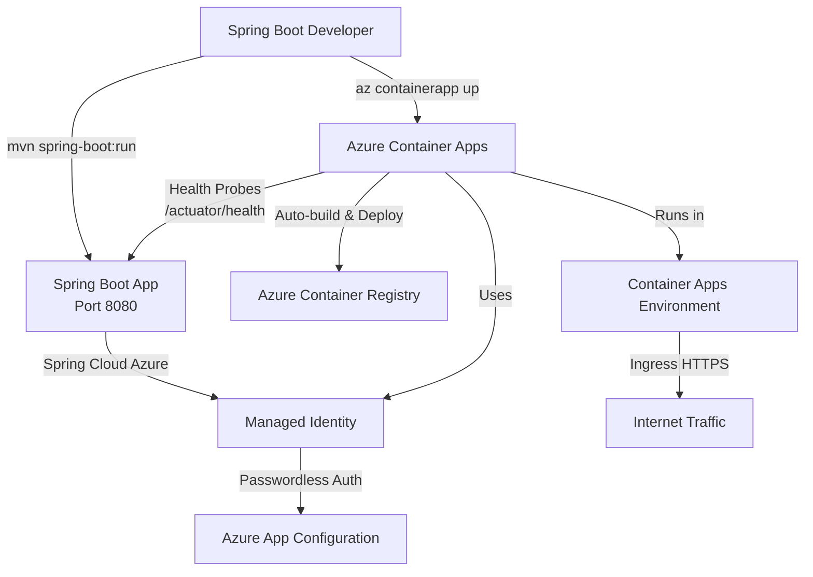

**8 min read**

## Introduction

Deploying containerized Spring Boot applications shouldn't require you to become a Kubernetes expert. Azure Container Apps provides a serverless container hosting platform that handles infrastructure management, auto-scaling, and ingress routing—letting you focus on writing Java code. With `az containerapp up`, you can deploy directly from source without writing Dockerfiles.

This guide walks through deploying a Spring Boot application to Azure Container Apps, configuring health probes for Java's longer startup times, and integrating Spring Cloud Azure with Managed Identity for passwordless authentication to Azure services like App Configuration.

## Architecture Overview

Here's how the components work together:



Your Spring Boot app runs locally for development, connects to Azure App Configuration via Managed Identity (using your Azure CLI credentials), and deploys to Container Apps with a single command.

## Prerequisites

Before you begin, ensure you have:

- **Java 21** or later installed
- **Maven 3.8+** for building the project
- **Azure CLI** (`az version` 2.50+)
- An **Azure subscription** (run `az login` to authenticate)
- Basic familiarity with Spring Boot and REST APIs

## Understanding Azure Container Apps for Java Developers

Azure Container Apps is built on Kubernetes but abstracts away the complexity. Key benefits for Spring Boot developers:

- **No Dockerfile required**: `az containerapp up` builds containers automatically from source
- **Built-in health probes**: Integrates with Spring Boot Actuator endpoints
- **Auto-scaling**: Scales to zero when idle, up to 10+ replicas under load
- **Managed Identity support**: Passwordless authentication to Azure services
- **Pay-per-use pricing**: Only charged for resources consumed

Think of it as "Azure App Service for containers" with better scaling and portability.

## Deploying Your First Spring Boot App

Start by creating a minimal Spring Boot project with the required dependencies:

```java
// pom.xml (key dependencies)
<dependencies>
    <dependency>
        <groupId>org.springframework.boot</groupId>
        <artifactId>spring-boot-starter-web</artifactId>
    </dependency>
    
    <dependency>
        <groupId>org.springframework.boot</groupId>
        <artifactId>spring-boot-starter-actuator</artifactId>
    </dependency>
    
    <dependency>
        <groupId>com.azure.spring</groupId>
        <artifactId>spring-cloud-azure-starter-appconfiguration</artifactId>
    </dependency>
</dependencies>
```

Create a simple REST controller to verify deployment:

```java
@RestController
public class ConfigController {
    
    @Value("${app.welcome.message:Default Welcome Message}")
    private String welcomeMessage;
    
    @GetMapping("/")
    public Map<String, String> home() {
        return Map.of(
            "message", welcomeMessage,
            "status", "Running on Azure Container Apps!"
        );
    }
}
```

Deploy to Azure with a single command:

```bash
az containerapp up \
  --name springboot-app \
  --resource-group rg-springboot-demo \
  --location eastus \
  --source . \
  --target-port 8080 \
  --ingress external
```

This command creates the Container Apps environment, builds your container, pushes to Azure Container Registry, and deploys—all in one step.

## Configuring Health Probes for Java Applications

Java applications take longer to start than lightweight Node.js or Go apps. Configure health probes with appropriate delays:

```yaml
# application.yml
management:
  endpoints:
    web:
      exposure:
        include: health,info
  endpoint:
    health:
      probes:
        enabled: true
      show-details: always

server:
  port: 8080
  shutdown: graceful
```

In your Bicep template, set `initialDelaySeconds` to account for JVM startup:

```bicep
probes: [
  {
    type: 'liveness'
    httpGet: {
      path: '/actuator/health/liveness'
      port: 8080
    }
    initialDelaySeconds: 60  // Give JVM time to start
    periodSeconds: 10
  }
  {
    type: 'readiness'
    httpGet: {
      path: '/actuator/health/readiness'
      port: 8080
    }
    initialDelaySeconds: 30
    periodSeconds: 5
  }
]
```

## Integrating Spring Cloud Azure with Managed Identity

Spring Cloud Azure 5.x provides seamless integration with Azure services using Managed Identity. First, create Azure App Configuration:

```bash
az appconfig create \
  --name myappconfig \
  --resource-group rg-springboot-demo \
  --location eastus

az appconfig kv set \
  --name myappconfig \
  --key app.welcome.message \
  --value "Hello from Azure App Configuration!"
```

Configure the Spring Cloud Azure starter:

```yaml
# application.yml
spring:
  cloud:
    azure:
      appconfiguration:
        enabled: true
        stores:
          - endpoint: ${AZURE_APPCONFIG_ENDPOINT}
            monitoring:
              enabled: false
      credential:
        managed-identity-enabled: true
```

When running locally, Azure SDK uses your `az login` credentials. In production, Container Apps uses the assigned Managed Identity—no connection strings or passwords required.

## Best Practices

- **Use health probes correctly**: Set `initialDelaySeconds: 60` for liveness probes to accommodate JVM startup time
- **Enable Managed Identity everywhere**: Avoid storing credentials in environment variables or configuration files
- **Configure graceful shutdown**: Set `server.shutdown: graceful` to handle in-flight requests during scale-down
- **Monitor with Log Analytics**: Container Apps environments automatically send logs to Log Analytics for troubleshooting
- **Use `az containerapp up` for demos**: For production, use Bicep/Terraform for repeatable infrastructure-as-code deployments

## Summary

Azure Container Apps provides a serverless, Kubernetes-based platform perfect for Spring Boot developers who want container portability without operational complexity. With `az containerapp up`, Spring Cloud Azure, and Managed Identity, you can build production-ready applications that authenticate securely to Azure services.

Check out the complete sample application at [spring-boot-azure-container-apps-guide](https://github.com/Azure-Samples/spring-boot-azure-container-apps-guide) for working code, Bicep templates, and deployment scripts.
