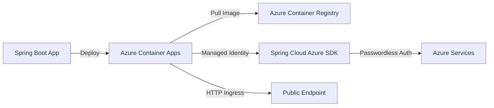

## Introduction

Azure Container Apps provides a serverless container hosting platform that lets Spring Boot developers deploy containerized applications without managing Kubernetes clusters directly. If you've been looking for a simpler alternative to AKS that still gives you container flexibility with automatic scaling, ingress, and Azure service integration, Container Apps is worth exploring.

This guide walks through deploying a Spring Boot application to Azure Container Apps, configuring health probes for Java's longer startup times, and integrating with Azure services using Managed Identity and Spring Cloud Azure. You'll learn practical patterns that work with your existing Spring Boot applications.

## Architecture



## Prerequisites

- **Java 21** installed locally
- **Maven 3.9+** for building the application
- **Azure CLI** installed (`az version` to verify)
- **Active Azure subscription** and logged in (`az login`)
- Basic familiarity with Spring Boot and Docker concepts

## Understanding Azure Container Apps for Java Developers

Azure Container Apps sits between Azure App Service and Azure Kubernetes Service. You get container flexibility without writing Kubernetes YAML. The platform handles:

- **Automatic scaling** from zero to N replicas based on HTTP traffic or custom metrics
- **Built-in ingress** with TLS termination and traffic splitting
- **Managed environment** including service discovery and Dapr integration
- **Container lifecycle** management with health probes and graceful shutdown

For Spring Boot developers, the key advantage is deploying containers using familiar tools while Azure manages the infrastructure.

## Deploying Your First Spring Boot App with az containerapp up

The fastest path to deployment uses `az containerapp up`, which builds and deploys in one command:

```bash
az containerapp up \
  --name spring-demo-app \
  --resource-group my-rg \
  --location eastus \
  --source . \
  --ingress external \
  --target-port 8080 \
  --env-vars SPRING_PROFILES_ACTIVE=azure
```

This command:
- Creates a Container Apps environment if needed
- Builds your Spring Boot JAR using Cloud Build
- Pushes the image to Azure Container Registry
- Deploys the container with external ingress on port 8080

Your app is live in minutes without writing a Dockerfile.

## Building Containers Without Docker Using Jib

For production workflows, use Jib to build optimized container images directly from Maven:

```xml
<plugin>
    <groupId>com.google.cloud.tools</groupId>
    <artifactId>jib-maven-plugin</artifactId>
    <version>3.4.0</version>
    <configuration>
        <to>
            <image>myregistry.azurecr.io/spring-app:${project.version}</image>
        </to>
        <container>
            <jvmFlags>
                <jvmFlag>-Xms512m</jvmFlag>
                <jvmFlag>-Xmx1024m</jvmFlag>
            </jvmFlags>
            <ports>
                <port>8080</port>
            </ports>
        </container>
    </configuration>
</plugin>
```

Build and push without Docker daemon:

```bash
mvn compile jib:build \
  -Djib.to.auth.username=00000000-0000-0000-0000-000000000000 \
  -Djib.to.auth.password=$(az acr login --name myregistry --expose-token --query accessToken -o tsv)
```

## Configuring Health Probes for Java Applications

Spring Boot applications often need 30-60 seconds to start. Configure startup, liveness, and readiness probes using Spring Boot Actuator:

```java
@RestController
public class HealthController {
    
    @GetMapping("/actuator/health/liveness")
    public ResponseEntity<Map<String, String>> liveness() {
        return ResponseEntity.ok(Map.of("status", "UP"));
    }
    
    @GetMapping("/actuator/health/readiness")
    public ResponseEntity<Map<String, String>> readiness() {
        return ResponseEntity.ok(Map.of("status", "UP"));
    }
}
```

Configure probes in your Container App:

```bash
az containerapp update \
  --name spring-demo-app \
  --resource-group my-rg \
  --startup-probe-type http \
  --startup-probe-path /actuator/health/liveness \
  --startup-probe-initial-delay 10 \
  --startup-probe-period 5 \
  --startup-probe-failure-threshold 12
```

This gives your app 60 seconds (5s × 12) to start before Container Apps restarts it.

## Integrating Spring Cloud Azure with Managed Identity

Use Managed Identity to authenticate to Azure services without managing credentials. First, add Spring Cloud Azure:

```xml
<dependency>
    <groupId>com.azure.spring</groupId>
    <artifactId>spring-cloud-azure-starter</artifactId>
    <version>5.22.0</version>
</dependency>
```

Configure in `application.yml`:

```yaml
spring:
  cloud:
    azure:
      credential:
        managed-identity-enabled: true
```

Access Azure services using `DefaultAzureCredential`:

```java
@Configuration
public class AzureConfig {
    
    @Bean
    public BlobServiceClient blobServiceClient() {
        return new BlobServiceClientBuilder()
            .endpoint("https://mystorageaccount.blob.core.windows.net")
            .credential(new DefaultAzureCredentialBuilder().build())
            .buildClient();
    }
}
```

Assign the Managed Identity to your Container App and grant it permissions to Azure resources.

## Best Practices

- **Use Jib or Buildpacks** for reproducible container builds without maintaining Dockerfiles
- **Set appropriate resource limits** (0.5-1 CPU, 1-2GB memory) to control costs while ensuring Java heap fits
- **Configure startup probes generously** for Spring Boot apps—use 60-90 second timeouts
- **Leverage Managed Identity** for all Azure service authentication instead of connection strings
- **Use Container Apps secrets** for non-Azure credentials, never hardcode in environment variables

## Summary

Azure Container Apps provides Spring Boot developers with a serverless container platform that handles infrastructure while preserving container flexibility. By combining `az containerapp up` for rapid deployment, Jib for production builds, and Spring Cloud Azure for passwordless authentication, you can deploy production-ready applications without managing Kubernetes. Check out the companion repository for a complete working example you can run locally and deploy to Azure.
